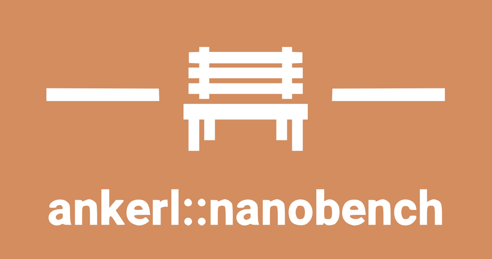

<a id="top"></a>


[](https://github.com/martinus/nanobench/releases)
[](https://raw.githubusercontent.com/martinus/nanobench/master/LICENSE)
[](https://travis-ci.com/martinus/nanobench)
[](https://ci.appveyor.com/project/martinus/nanobench)
[](https://gitter.im/nanobench/community?utm_source=badge&utm_medium=badge&utm_campaign=pr-badge&utm_content=badge)

`ankerl::nanobench` is a platform independent microbenchmarking library for C++11/14/17/20.

```cpp
#define ANKERL_NANOBENCH_IMPLEMENT
#include <nanobench.h>

int main() {
    double d = 1.0;
    ankerl::nanobench::Config().run("some double ops", [&] {
        d += 1.0 / d;
        if (d > 5.0) {
            d -= 5.0;
        }
    }).doNotOptimizeAway(d);
}
```

Runs for ~3ms to print

```markdown
|               ns/op |                op/s |    err% |          ins/op |          cyc/op |    IPC |         bra/op |    mis% |     total | benchmark
|--------------------:|--------------------:|--------:|----------------:|----------------:|-------:|---------------:|--------:|----------:|:----------------------------------------------
|                8.74 |      114,422,483.01 |    0.6% |            8.32 |           27.88 |  0.298 |           1.00 |    8.6% |      0.00 | some double ops
```

Which github renders as

|               ns/op |                op/s |    err% |          ins/op |          cyc/op |    IPC |         bra/op |    mis% |     total | benchmark
|--------------------:|--------------------:|--------:|----------------:|----------------:|-------:|---------------:|--------:|----------:|:----------------------------------------------
|                8.74 |      114,422,483.01 |    0.6% |            8.32 |           27.88 |  0.298 |           1.00 |    8.6% |      0.00 | some double ops

# Design Goals

* **Ease of use**: Simple but powerful API, fast compile times, easy to integrate anywhere.
* **Fast**: Get accurate results as fast as possible
* **Accurate**: Get deterministic, repeatable, and accurate results that you can make sound decisions on.
* **Robust**: Be robust against outliers, warn if results are not reliable.

# How to Use it

* [Tutorial](docs/tutorial.md#top) - getting started
* [Reference](docs/reference.md#top) - all the details
* [Comparison](docs/comparison.md#top) - comparison with other microbenchmark frameworks

# More

* [Code of Conduct](CODE_OF_CONDUCT.md) - Contributor Covenant Code of Conduct
* I need a better logo. Currently I use a small bench. Nanobench. Ha ha.

