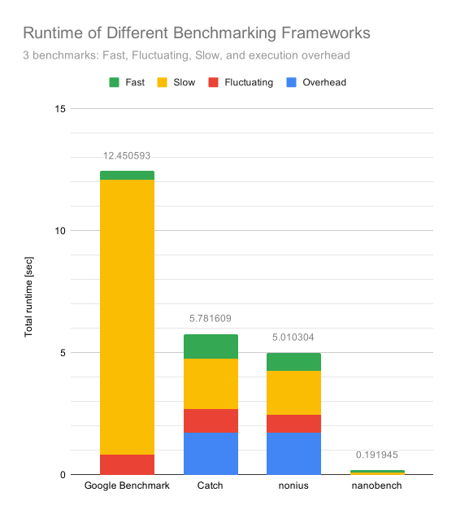

================================
Comparison with Other Frameworks
================================

I've implemented the three different benchmarks: Fast, Slow, Fluctuating in several frameworks for comparison.

Fast
    Benchmarks ``x += x``, starting from 1. This is a single instruction, and prone to be optimized away.

Slow
    Benchmarks ``std::this_thread::sleep_for(std::chrono::milliseconds(10))``. For a microbenchmark this
    is very slow, and it is interesting how the framework's autotuning deals with this.

Fluctuating
    A microbenchark that is tuned so that each evaluation takes a different time. This is fluctuating runtime
    is achieved by randomly producing 0-255 random numbers with `std::mt19937_64`.

All benchmarks are run on an i7-8700 CPU locked at 3.2GHz, using
`pyperf system tune <https://pyperf.readthedocs.io/en/latest/system.html>`_.

-------
Summary
-------

Runtimes
========

======================  =====  ======   ===========
Benchmarking Framework  Fast   Slow     Fluctuating
======================  =====  ======   ===========
Google Benchmark        0.365  11.274         0.828
nonius                  0.713   1.883         0.819
======================  =====  ======   ===========

---------
nanobench
---------

Sourcecode
==========

.. literalinclude:: ../src/comparisons/nanobench/main.cpp
    :language: c++
    :linenos:

Results
=======

.. literalinclude:: ../src/comparisons/nanobench/out.txt
    :language: text

----------------
Google Benchmark
----------------

Very feature rich, battle proven, but a bit aged. Requires google test. Get it here: `google Benchmark <https://github.com/google/benchmark>`_

Sourcecode
==========

.. literalinclude:: ../src/comparisons/google_benchmark/gbench.cpp
    :language: c++
    :linenos:

Results
=======

Compiled & linked with 

.. code-block:: sh

   g++ -O2 main.cpp -L/home/martinus/git/benchmark/build/src -lbenchmark -lpthread -o gbench

executing it gives this result:

.. literalinclude:: ../src/comparisons/google_benchmark/out.txt
    :language: text

Running the tests individually takes 0.365s, 11.274 sec, 0.828sec.

------
nonius
------

It gives lots of statistics, but seems a bit complicated to me. Not as straight forward as I'd like it. It shows lots of statistics, which makes the output a bit hard to read. I am not sure if it is still actively maintained. The homepage has been down for a while.
Get it here: `nonius <https://github.com/libnonius/nonius>`_

Sourcecode
==========

.. literalinclude:: ../src/comparisons/libnonius_nonius/main.cpp
    :language: c++
    :linenos:

Results
=======

.. literalinclude:: ../src/comparisons/libnonius_nonius/out.txt
    :language: text

The tests individually take 0.713sec, 1.883sec, 0.819sec. Plus a startup overhead of 1.611sec.

---------
Picobench
---------

It took me a while to figure out that I have to configure the slow test, otherwise it would run for a looong time. The number of iterations is hardcoded, this library seems very basic. Get it here:
`picobench <https://github.com/iboB/picobench>`_

Sourcecode
==========

.. literalinclude:: ../src/comparisons/iboB_picobench/picobench.cpp
    :language: c++
    :linenos:

Results
=======

.. literalinclude:: ../src/comparisons/iboB_picobench/out.txt
    :language: text

It doesn't really make sense to provide runtime numbers here, because picobench just executes the given number of iterations, and that's it. No autotuning.

------
Catch2
------

Catch2 is mostly a unit testing framework, and has recently integrated benchmarking faciliy. It is very easy to use, but does not seem too configurable. I find the way it writes the output very confusing. Get it here:
`Catch2 <https://github.com/catchorg/Catch2>`_

Sourcecode
==========

.. literalinclude:: ../src/comparisons/catchorg_Catch2/catch.cpp
    :language: c++
    :linenos:

Results
=======

.. literalinclude:: ../src/comparisons/catchorg_Catch2/out.txt
    :language: text

----------------------
moodycamel::microbench
----------------------

A very simple benchmarking tool, and an API that's very similar to ``ankerl::nanobench``. No autotuning,
no doNotOptimize, no output formatting. Get it here: `moodycamel::microbench <https://github.com/cameron314/microbench>`_

Sourcecode
==========

.. code-block:: c++
   :linenos:

    #include "microbench.h"

    #include <chrono>
    #include <iostream>
    #include <random>
    #include <thread>

    // g++ -O2 -c systemtime.cpp
    // g++ -O2 -c microbench.cpp
    // g++ microbench.o systemtime.o -o mb
    int main(int, char**) {
        // something fast
        uint64_t x = 1;
        std::cout << moodycamel::microbench([&]() { x += x; }, 10000000, 51) << " sec x += x (x==" << x << ")" << std::endl;

        std::cout << moodycamel::microbench([&] { std::this_thread::sleep_for(std::chrono::milliseconds(10)); }) << " sec sleep 10ms"
                << std::endl;

        std::random_device dev;
        std::mt19937_64 rng(dev());
        std::cout << moodycamel::microbench(
                        [&] {
                            // each run, perform a random number of rng calls
                            auto iterations = rng() & UINT64_C(0xff);
                            for (uint64_t i = 0; i < iterations; ++i) {
                                (void)rng();
                            }
                        },
                        1000, 51)
                << " sec random fluctuations" << std::endl;
    }

Results
=======

.. code-block:: text

    3.13623e-07 sec x += x (x==0)
    10.0188 sec sleep 10ms
    0.000936755 sec random fluctuations

------
Celero
------

Unfortunately I couldn't get it working. I only got segmentation faults for my ``x += x`` benchmarks.
Get it here: `celero <https://github.com/DigitalInBlue/Celero>`_

---------------
folly Benchmark
---------------

Facebook's folly comes with benchmarking facility. It seems rather basic, but with good ``DoNotOptimizeAway``
functionality. Honestly, I was too lazy to get this working. Too much installation hazzle. Get it here:
`folly <https://github.com/facebook/folly>`_

