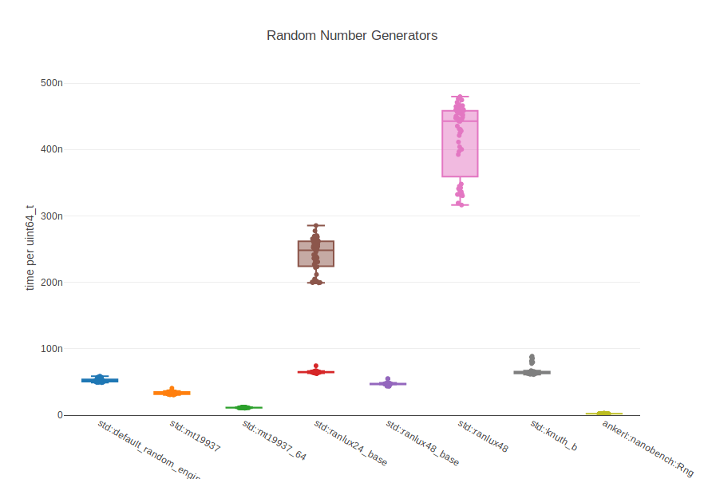

<a id="top"></a>
# Reference

## Processing Results

The `Config` class comes with a powerful [mustache](https://mustache.github.io/)-like template mechanism to process the benchmark results into all kinds of formats. After all benchmarks have been run, you can e.g. create a nice boxplot of all results with:

```cpp
std::ofstream fout("example_random_number_generators.json");
bench.render(ankerl::nanobench::templates::htmlBoxplot(), fout);
```



Namespace `ankerl::nanobench::templates` comes with several predefined templates:

| **template** | **Result** |
|---|---|
| `csv` | Produces comma-separated value (CSV) content |
| `json` | All available data will be generated into one JSON file. Use this as an example for your own templates. |
| `htmlBoxplot` | Generates a HTML page that uses [plotly.js](https://plot.ly/javascript/) with a boxplot graph of all the results. This gives a very nice visual representation of all the data |

The JSON template demonstrates *all* possible variables that can be used in the mustache-like templating language:

```
{
 "title": "{{title}}",
 "unit": "{{unit}}",
 "batch": {{batch}},
 "benchmarks": [
{{#benchmarks}}  {
   "name": "{{name}}",
   "median_sec_per_unit": {{median_sec_per_unit}},
   "md_ape": {{md_ape}},
   "min": {{min}},
   "max": {{max}},
   "relative": {{relative}},
   "num_measurements": {{num_measurements}},
   "results": [
{{#results}}    { "sec_per_unit": {{sec_per_unit}}, "iters": {{iters}}, "elapsed_ns": {{elapsed_ns}}, "pagefaults": {{pagefaults}}, "cpucycles": {{cpucycles}}, "contextswitches": {{contextswitches}}, "instructions": {{instructions}}, "branchinstructions": {{branchinstructions}}, "branchmisses": {{branchmisses}}}{{^-last}}, {{/-last}}
{{/results}}   ]
  }{{^-last}},{{/-last}}
{{/benchmarks}} ]
}
```

In short:

* `{{whatever}}` will be replaced by the content of the identifier.
* `{{#benchmarks}}` opens a section, that will be rendered once for each benchmark. The section is closed by `{{/benchmarks}}`.
* `{{#results}}` opens a section for each result (epoch) within a benchmark.
* Within each section, you can use `{{#-last}}whatever{{/-last}}` to print `whatever` only for the last entry, `{{#-first}}` for only the first, `{{^-last}}` for anything *but* the last, `{{^-first}}` for anything *but* the first. In the JSON example, this is used to add a comma `, ` after each result except the last one.


# ankerl::nanobench::Rng

This is an implementation of Small Fast Counting RNG, version 4. The original implementation can be found in [PractRand](http://pracrand.sourceforge.net). It also passes all tests of the practrand test suite. When you need random numbers in your benchmark, this is your best choice. In my benchmarks, it is 20 times faster than `std::default_random_engine` for producing random `uint64_t` values:

| relative |         ns/uint64_t |          uint64_t/s |   MdAPE |   ins/uint64_t |   cyc/uint64_t |    IPC |branch/uint64_t | missed% | Random Number Generators
|---------:|--------------------:|--------------------:|--------:|---------------:|---------------:|-------:|---------------:|--------:|:----------------------------------------------
|   100.0% |               42.24 |       23,671,446.65 |    1.5% |         184.72 |         134.90 |  1.369 |          15.50 |    2.8% | `std::default_random_engine`
|   195.8% |               21.57 |       46,351,638.16 |    1.2% |         174.93 |          68.88 |  2.540 |          23.99 |    4.3% | `std::mt19937`
|   550.5% |                7.67 |      130,317,142.34 |    1.3% |          43.48 |          24.50 |  1.774 |           4.99 |   10.2% | `std::mt19937_64`
|    92.1% |               45.86 |       21,803,766.11 |    0.6% |         211.58 |         146.49 |  1.444 |          26.51 |    5.6% | `std::ranlux24_base`
|   124.5% |               33.92 |       29,478,806.51 |    0.4% |         144.01 |         108.33 |  1.329 |          17.00 |    4.9% | `std::ranlux48_base`
|    21.2% |              199.49 |        5,012,780.11 |    0.9% |         716.43 |         637.00 |  1.125 |          95.08 |   15.8% | `std::ranlux24_base`
|    10.9% |              386.79 |        2,585,356.75 |    2.2% |       1,429.99 |       1,234.62 |  1.158 |         191.51 |   15.6% | `std::ranlux48`
|    65.2% |               64.76 |       15,442,579.88 |    1.3% |         356.97 |         206.55 |  1.728 |          33.05 |    0.8% | `std::knuth_b`
| 2,069.1% |                2.04 |      489,778,900.82 |    0.1% |          18.00 |           6.52 |  2.760 |           0.00 |    0.0% | `ankerl::nanobench::Rng`

It has a special member to produce `double` values in the range `[0, 1(`. That's  over 3 times faster than using `std::default_random_engine` with `std::uniform_real_distribution`.

| relative |               ns/op |                op/s |   MdAPE |         ins/op |         cyc/op |    IPC |      branch/op | missed% | random double in [0, 1(
|---------:|--------------------:|--------------------:|--------:|---------------:|---------------:|-------:|---------------:|--------:|:----------------------------------------------
|   100.0% |                9.59 |      104,261,200.65 |    0.2% |          48.00 |          30.61 |  1.568 |           3.00 |    0.0% | `std::default_random_engine & std::uniform_real_distribution`
|   191.4% |                5.01 |      199,574,821.11 |    0.6% |          23.00 |          16.00 |  1.438 |           2.50 |   19.9% | `ankerl::nanobench::Rng & std::uniform_real_distribution`
|   340.8% |                2.81 |      355,346,638.93 |    0.0% |          14.00 |           8.99 |  1.557 |           0.00 |    0.0% | `ankerl::nanobench::Rng::uniform01()`


# Environment Variables

## NANOBENCH_ENDLESS

Sometimes it helps to run a benchmark for a very long time, so that it's possible to attach with a profiler like `perf` and get meaningful statistics. This can be done with the environment variable `NANOBENCH_ENDLESS`. E.g. to run the benchmark with the name `x += x` infinitely, call the app this way:

```sh
NANOBENCH_ENDLESS="x += x" ./nb
```

## NANOBENCH_SHOW_TOTAL_RUNTIME

If set, shows total runtime of the benchmark in the table:

```sh
NANOBENCH_SHOW_TOTAL_RUNTIME=1 ./nb
```
